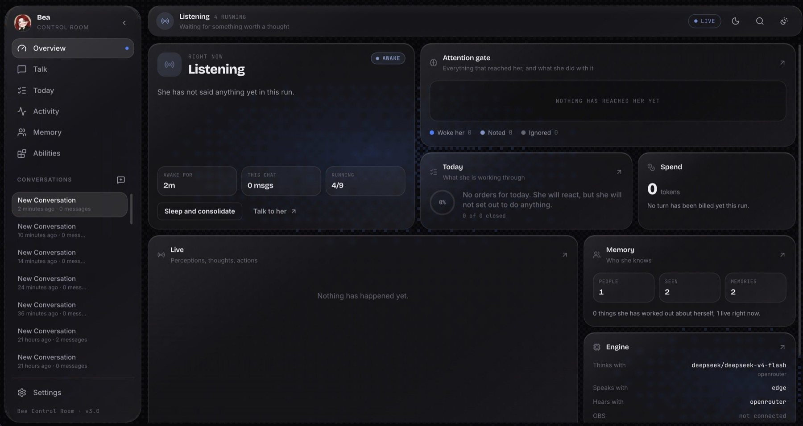

# ProjectBEA — AI Persona Engine

**ProjectBEA** is a modular AI persona engine. It runs **Bea**: one always-on
consciousness that talks out loud, plays Minecraft on a vanilla server with
other people, holds conversations on Discord, Telegram and Twitch, remembers who
you are across sessions, and works through the objectives her owner sets for the
stream.

Everything she perceives arrives on one bus, passes an attention gate, and
reaches a single mind that acts through tools. Every capability is a swappable
plugin.




<p align="center"><em>The control room: everything she is perceiving, thinking and doing, on one screen.</em></p>

---

## Features

| Feature | Description |
|---|---|
| **One mind, many places** | Discord, Telegram, Twitch, Minecraft and the dashboard all feed a single consciousness |
| **Attention** | She reacts to what concerns her and merely notices the rest, so a busy chat costs almost nothing |
| **Parallel conversations** | One turn at a time per channel, several channels at once — she talks on stage and texts at the same time |
| **Memory** | Diary, person cards and self-lore in one SQLite file, with local embeddings |
| **Minecraft** | A body on a vanilla server: she plays toward objectives, reads game chat and remembers players |
| **Stream Plan** | Set today's objectives from the dashboard — she works through them and ticks them off |
| **Swappable LLMs** | OpenRouter, OpenAI, Groq — configured per role, pooled for rotation and fallback |
| **Multiple TTS engines** | EdgeTTS (free), Kokoro (local ONNX), Orpheus (API) |
| **OBS Integration** | Avatar swap and animated text bubble over WebSocket |
| **Control Room** | React + FastAPI: a bento overview, chat, stream plan, live attention gate, her memory, abilities and every setting |
| **Hot Reload** | Change models, voices or settings at runtime, without a restart |
| **Plugin Skills** | Every capability is a `Skill` — add your own in minutes |

---

## Architecture Overview

Every sense pushes onto one bus. An attention gate decides what is worth a
thought. One mind reasons over it and acts through tools.

```
  discord · telegram · twitch · minecraft · donations · the dashboard
                          │  perceptions
                          ▼
                  ┌───────────────┐
                  │ PerceptionBus │
                  └───────┬───────┘
                          ▼
                  ┌───────────────┐   react / note / drop
                  │   Attention   │───────────────┐
                  └───────┬───────┘               │
            react ────────┤                       │ noted
                          ▼                       ▼
        ┌─────────────────────────┐        [WHILE YOU WERE BUSY]
        │  the live loop (stage)  │        peripheral awareness
        │  voice · game · owner   │
        └────────────┬────────────┘
                     │  written channels
                     ▼
        ┌─────────────────────────┐
        │ scoped conversation turns│  one per channel, in parallel
        └─────────────────────────┘
                     │
                     ▼  tools
   speak · mc_chat · discord_reply · play_minecraft · objective_done · …
                     │
                     ▼
        Expression → TTS + OBS      ·      bea.db (memory)
```

**[Full Architecture Documentation →](docs/architecture.md)**

---

## Project Structure

```
ProjectBEA/
├── main.py                 # thin wrapper; the entrypoint is src/cli.py
├── config.example.json     # copy to config.json and edit
├── Makefile                # install · run · web · test · lint · migrate
├── data/
│   ├── bea.db              # everything she remembers (gitignored)
│   ├── conversations/      # session transcripts
│   ├── pngs/               # avatars per mood (idle/talking)
│   └── prompts/            # soul · operating · monologue · minecraft
├── docs/
├── tests/                  # 593 tests, no network
└── src/
    ├── cli.py              # argument parsing and composition
    ├── core/
    │   ├── brain.py        # composition root
    │   ├── consciousness.py# the one always-on loop
    │   ├── config.py
    │   ├── events.py       # pub/sub + SSE fan-out
    │   ├── perception/     # bus, Perception, Author
    │   ├── attention/      # the gate: rules (pure) + state
    │   ├── mind/           # routing, scheduler, conversations, correlation
    │   ├── memory/         # sqlite, rag, embedder, profiler, plan
    │   ├── expression/     # the single output sink + humanizer
    │   ├── agent/          # LLMClient, role pools, tools, runner
    │   └── skills/         # one package per capability
    ├── interfaces/         # TTS · STT · OBS contracts
    ├── modules/            # llm · tts · STT · obs implementations
    ├── utils/
    └── web/
        ├── app.py          # FastAPI
        └── frontend/       # React + Vite + Tailwind
```

---

## Quick Start

### 1. Prerequisites

- [uv](https://docs.astral.sh/uv/) — manages Python and dependencies (installs Python for you)
- Node.js 18+ (for the web dashboard and the Discord bot)
- OBS Studio with WebSocket plugin enabled *(Tools → WebSocket Server Settings)*
- A virtual audio cable such as [VB-Audio Cable](https://vb-audio.com/Cable/) *(optional but recommended)*

### 2. Install dependencies

```bash
uv sync          # or: make install
```

### 3. Configure

Copy `.env.example` to `.env` (or set environment variables directly):

```env
OPENROUTER_API_KEY=sk-or-...
OPENAI_API_KEY=sk-...
GROQ_API_KEY=gsk_...
DISCORD_TOKEN=...
```

Review `config.json` to set your OBS source names, audio device ID, TTS voice, and which skills are enabled.

**[Full Configuration Guide →](docs/configuration.md)**

### 4. Run

**CLI mode** (terminal interactive):
```bash
uv run bea       # or: make run
```

**Web Dashboard mode** (FastAPI + React UI):
```bash
uv run bea --web # or: make web  (builds the frontend too)
```

**Override provider at launch:**
```bash
uv run bea --llm-provider openrouter --tts-provider kokoro --web
```

**[Setup & Deployment Guide →](docs/setup.md)**

### 5. Tests and lint

```bash
make test        # uv run pytest -q
make lint        # uv run ruff check src tests
```

The suite runs without network access or API keys: every model client, surface
and transport is faked.

---

## Modules

The engine is built around three types of components, each defined by an abstract interface in `src/interfaces/base_interfaces.py`. Any provider can be swapped without touching the core.

| Component | Interface | Implementations |
|---|---|---|
| **LLM** | `LLMClient` (tool-aware) | OpenRouter, OpenAI, Groq |
| **TTS** | `TTSInterface` | EdgeTTS, Kokoro (local), Orpheus |
| **STT** | `STTInterface` | Groq, OpenRouter (Whisper) |
| **OBS** | `OBSInterface` | OBS WebSocket (obs-websocket-py) |

Models are configured per **role** rather than one at a time: `mind` for the
consciousness, `background` for the diary, the dreamer and the game body. Each
role is a pool that round-robins to spread rate limits and falls back when a
provider is down.

**[LLM Modules →](docs/modules/llm.md)** · **[TTS Modules →](docs/modules/tts.md)** · **[STT →](docs/modules/stt.md)** · **[OBS →](docs/modules/obs.md)**

---

## Skills — Plugin System

A skill is one capability of the single mind. It can perceive, expose tools,
contribute prompt rules and own infrastructure — and every one can be toggled at
runtime from the dashboard. Bea can never arm a capability herself.

| Skill | Description |
|---|---|
| **[Discord](docs/skills/discord.md)** | Voice calls and text channels; owns the Node.js bot |
| **[Telegram](docs/skills/telegram.md)** | Private chats and groups, in-process |
| **[Twitch](docs/skills/twitch.md)** | Chat read anonymously; volume becomes texture, not thoughts |
| **[Minecraft](docs/skills/minecraft.md)** | A body on a vanilla server: she plays, chats and remembers players |
| **[Donations](docs/skills/donations.md)** | A webhook that always earns a reaction |
| **[Stream Plan](docs/skills/plan.md)** | Today's objectives, set by the owner |
| **[Memory](docs/skills/memory.md)** | Diary entries and recall, over one SQLite file |
| **[Social](docs/skills/social.md)** | Who people are: a tally for everyone, a card for the ones who matter |
| **[Dream](docs/skills/dream.md)** | Sleep, self-lore and nightly consolidation |
| **[Monologue](docs/skills/monologue.md)** | Filling the silence when nothing is happening |

**[Skills Overview →](docs/skills/overview.md)**

---

## Web Dashboard

The `--web` flag starts a FastAPI backend (port 8000) and serves a React + Tailwind frontend.

It opens on a boot screen that checks the brain is actually answering before it
lets you in, then on a bento overview of everything at once.

**Screens:**
- **Overview** — is she awake, what she last said, today's progress, the
  attention gate, spend, abilities, and the live feed, all on one screen
- **Talk** — the private line to her: streams voice in and out, and shows it
  plainly when she hears you and chooses not to answer
- **Today** — the orders she reads every turn, plus objectives you can reorder,
  edit and close; she closes them herself as she goes
- **Activity** — the attention gate drawn live, and a filterable, freezable
  event stream underneath it
- **Memory** — who she knows, everyone she has met, a search over what she
  remembers, and the things she has worked out about herself
- **Abilities** — every capability on or off at runtime, plus the Minecraft cockpit
- **Settings** — eight sections with connection tests, and one save for all of them

`⌘K` opens the command palette from anywhere.

The API has no authentication, so the server binds to `127.0.0.1` unless
`--host` says otherwise. Do not put it on a public address as it stands.

**[API Reference →](docs/web/api.md)** · **[Frontend →](docs/web/frontend.md)**

---

## Full Documentation

| Document | Contents |
|---|---|
| [Architecture](docs/architecture.md) | System design, data flow, event system |
| [Setup & Install](docs/setup.md) | Installation, OBS setup, audio routing |
| [Configuration](docs/configuration.md) | All config fields, CLI args, `.env` vars |
| [LLM Modules](docs/modules/llm.md) | Providers, response format, adding new LLMs |
| [TTS Modules](docs/modules/tts.md) | EdgeTTS, Kokoro, Orpheus |
| [OBS Module](docs/modules/obs.md) | Avatar control, text animation |
| [STT Module](docs/modules/stt.md) | Whisper transcription |
| [Skills Overview](docs/skills/overview.md) | The `Skill` API, the registry, every tool |
| [Memory](docs/skills/memory.md) | Recall, the diary, the embedding model |
| [Social](docs/skills/social.md) | The roster, person cards, promotion |
| [Dream](docs/skills/dream.md) | Self-lore, hot facts, the nightly pass |
| [Stream Plan](docs/skills/plan.md) | Objectives, and what makes her act on them |
| [Discord](docs/skills/discord.md) | The bot, the voice pipeline, the tools |
| [Telegram](docs/skills/telegram.md) | In-process polling and scoped turns |
| [Twitch](docs/skills/twitch.md) | Anonymous IRC, tally, chat as texture |
| [Donations](docs/skills/donations.md) | The webhook and what one donation writes |
| [Minecraft](docs/skills/minecraft.md) | The body, the mod protocol, the goal loop |
| [Monologue](docs/skills/monologue.md) | The idle perception |
| [Web API](docs/web/api.md) | Every REST endpoint |
| [Frontend](docs/web/frontend.md) | React component structure |

---

## Extending ProjectBEA

The modular design makes adding new capabilities straightforward:

- **New LLM provider** → extend `OpenAICompatibleClient`, add it to `factory.build_client()`
- **New TTS engine** → implement `TTSInterface`, add the branch and the CLI choice in `src/cli.py`
- **New skill** → extend `Skill`, register it in `AIVtuberBrain._build_consciousness()`
- **New text platform** → extend `PlatformSkill` and the roster, person cards, attention gate and scoped conversations work with no extra code

See [Skills Overview](docs/skills/overview.md) for the full plugin API.

---

## About

Built by **Emanuele Faraci**, 19-year-old Computer Science student from Italy.

This project started as a way to learn Python properly, specifically async programming, API integrations, and modular system design, while building something actually fun. It grew from a simple TTS + OBS script into a full persona engine with skills, memory, and a web dashboard.

just a side project built for fun and learning.

**Portfolio:** [emanuelefaraci.com](https://emanuelefaraci.com)

---

## License

This project is open-source. See `LICENSE` for details.

